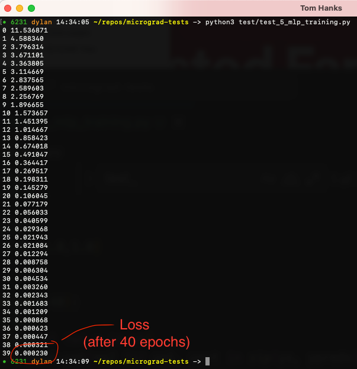

# 0. Prereqs

Please see the [README](README.md) for details on how to use the below material and ensure you've watched the entirety of Andrej's micrograd [walkthrough video](https://www.youtube.com/watch?v=VMj-3S1tku0) before beginning your implementation.

# 1. Operators

Starting with the provided skeleton of the`Value` class in `value0.py`, we will implement the methods that will allow us to use (infix) operators on instances of the`Value` class. 

For this step, we can ignore the `grad` and `_backward` properties (they will be completed in the next step). 

We want to implement the following methods for the `Value` class:
* `__add__`    (value + value = value, value + x = value)
* `__mul__`    (value * value = value)
* `__pow__`    (value ** x = value)
* `__neg__`    (-value = value)
* `__radd__`    (x + value = value)
* `__sub__`    (value - value = value, value - x = value)
* `__rsub__`    (x - value = value)
* `__rmul__`    (x * value = value)
* `__truediv__`    (value / value = value, value / x )
* `__rtruediv__`    (x / value = value)

**Tips:** 
- I recommend implementing in the order presented above, as some of your method implementations may rely on previously implemented methods.
- When creating new `Value` objects in your implemention, don't forget to pass the _op and _children variables!
- You only need to explicitly create a new `Value` object in the `__add__`, `__mul__` and `__pow__`` methods.
- Remember we want to be able to pass primitive valued arguments to some of these methods, so check for this and wrap primitive values where required!
- See: [operator-overloading-in-python](https://www.geeksforgeeks.org/operator-overloading-in-python/) for more information on operator overloading in Python.

You will know you are finished when the test file `test_1_operators.py` successfully runs without any errors.

My implementation for this step is in `value1.py`

# 2. Gradients

1. Implement the `_backward()` nested function for each of the `__add__`, `__mul__`, `__pow__` operators.
2. Implement the `topo_sort()` method on the `Value` class that will:
return the topologically sorted graph, self should be appended last
3. Implement the `backward()` method on the `Value` class that will: 
call `_backward()` on every node, in reverse topo order

**Tips:** 
- Use the chain rule to propogate gradient to the children/prev nodes of each operator
- Remember gradients should be additive (use `+=` not `=`)
- Don't forget to initialize the gradient to 1.0 before the `_backward()` calls in `backward()`

You will know you are finished when the test file `test_2_ backward.py` successfully runs without any errors.

My implementation for this step is in `value2.py`

# 3. Non-Linear Activation Functions
We're now going to implement two non-linear (activation) functions: *Tanh* and *Relu*

We really only need to implement one of these, but we'll implement both so we can compare them later.

Add a method for each nonlinear function to the `Value` class.

**Tips:** 
  - You can easily find the definition/derivative of both functions on google/wikipedia.
  - Each method will return a new value object, with `self` as the only child/prev node (like in `Value.__pow__()`).
  - Remember to implement the derivate for each function in a nested _backward() function, remembering to use the chain rule.

You will know you are finished when the test file `test_3_nonlinear.py` successfully runs without any errors.

My implementation for this step is in `value3.py`

# 4. Multi-Layer Perceptron
It's time for our neural network to take shape! We can now make use of all the hardwork we've put into the `Value` class.

Start with the skeleton `MLP` class that you can find in `mlp0.py`.

Don't worry about the gradients/backward pass for now, we will look at those details in the next section.

We'll first create a `Neuron` class:
- Each neuron instance maintains a list of *nin* incoming weight values (`Value` instances), where *nin* is passed as a constructor arg
- A neuron instance will have a single bias term (i.e. a `Value` instance).
- We'll need to randomly initialize these weight and bias values (backpropogration doesn't work if all initial values are 0.0)
- Implement the `Neuron.__call__` method which will be used for the forward pass:
  - Takes a list `x` of input values and computes `w*x + b`, where * is matrix dot product.
  - We need to apply the ReLU activation function to this summed value before returning it

Next, let's implement a `Layer` class:
- A layer is just a collection of neurons. Each layer will be parameterized by the number of input/output connections.
- For example, Layer(nin=3, nout=4) tells us that the previous layer has 3 neurons, and this layer will have 4 neurons.
- Each layer will maintain a list of *nout* neuron instances.
- The `Layer.__call__` method here will iterate through the layer neurons and call each (i.e. calling the `Layer.__call__` function we created above)
- The resulting values should be returned as a list from the `Layer.__call__` method. If a layer has only one value, return it as a single value.

Finally, we need an `MLP` class:
- This should take as input the number of inputs we have *nin* and the layer structure we want. 
- Layer structure can be passed as so: [4,4,1] which means we have two hidden layers of size 4, and an output layer with a single value.
- Each `MLP` instance should instantiate and maintain the list of Layer objects.
- The `MLP.__call__` method will iterate through the layers, computing the forward pass at each layer and providing it as input to the next.

**Tips:** 
- Import the random package which can be used be used for choosing random values for weights/biases, e.g. `random.uniform(1,-1)`.
- The number of weights incoming weights to a neuron will depend on the structure of our neural network, and which layer the neuron is in.
- *MLP(3,[4,4,1])* will create an MLP with 3 input values, 2 hidden layers with 4 neurons each and single valued output layer.

You will know you are finished when the test file `test_4_mlp.py` successfully runs without any errors.

My implementation for this step is in `mlp1.py`

# 5. MLP Training

**Parameters**
1. Implement the `parameters` method on the `Neuron` class that returns a list of the neurons weight and bias values.
2. Implement the `parameters` method on the `Layer` class that returns all the weights/biases of every neuron in the layer.
3. Implement the `parameters` method on the `MLP` class that returns all the weights/biases of every layer in the mlp.

**Making the output layer linear**
* We need to modify the `MLP` code so that we don't apply the *ReLU* activation function to the output of the final layer. 
* A layer where we don't apply an activation function is referred to as a "linear" layer in frameworks like Pytorch. 

**Zero Grad**
* We need to add a `zero_grad` method to the MLP class that when called sets the gradients of all trainable parameters back to 0.
* This will be called during each iteration of our training loop to prevent gradients from accumulating from one epoch to the next.

When you are ready run the test file `test_5_mlp_training.py` which perform the above training loop over 40 epochs. The output should look something like this:

Example output: 

The final implementations are found in `value.py` and `mlp.py`

# Next Steps

For now we have ignored a lot of important topics that need be considered when training neural networks, including:
  - Regularization
  - Early stopping
  - Adaptive learning rates
  - Alternative loss functions
  - Stochastic Gradient Descent (mini-batches)

Exploring these topics and then using them to implement a more sophisticated training loop for our Multi-Layer Perceptron would be a great exercise to complete next.